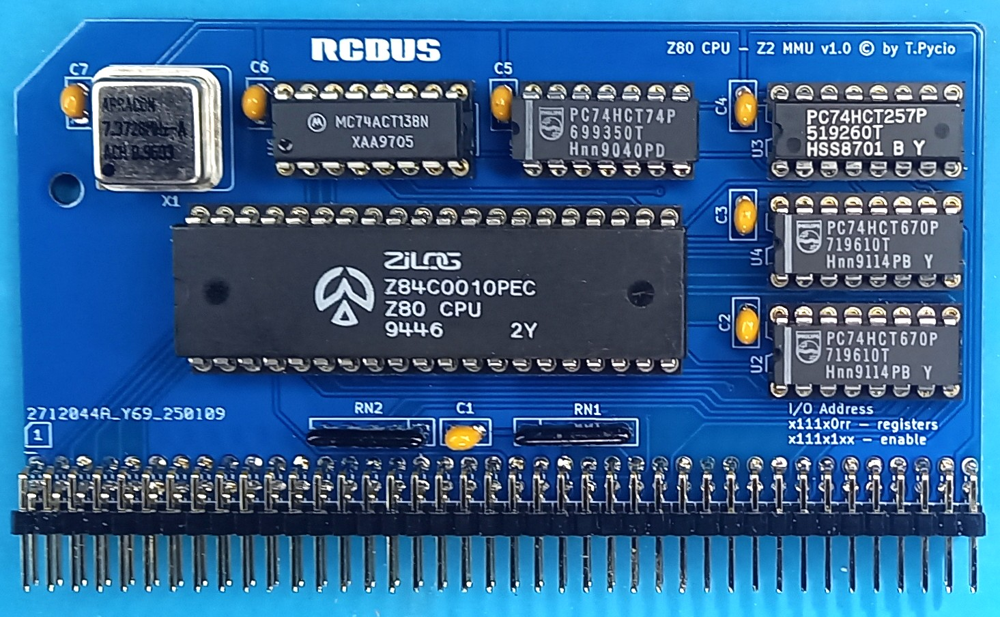

# Z80-MMU Z2 for RCBus

Module Z80 CPU and MMU Z2 ( [SBC Zeta v2](https://github.com/skiselev/zeta_sbc) ) for RCBus systems

## Hardware Documentation

### Schematic

[Schematic - Version 1.0](schematic.pdf)

## Bill of Materials

| Component type     | Reference | Description                                  | Quantity |
| ------------------ | --------- | -------------------------------------------- | -------- |
| PCB                |           | Z80 - Z2 MMU PCB - Version 1.0               | 1        |
| Integrated Circuit | U1        | Z84C00xxPEG - Z80 CPU, CMOS, 40 pin DIP      | 1        |
| Integrated Circuit | U2,U4     | 74HCT670 - 4x4bit register, 16 pin DIP       | 2        |
| Integrated Circuit | U3        | 74HCT257 - 4x2-input multiplexer, 16 pin DIP | 1        |
| Integrated Circuit | U5        | 74HCT74 - Dual D flip-flop, 14 pin DIP       | 1        |
| Integrated Circuit | U6        | 74HCT138 - 3-to-8 line decoder, 16 pin DIP   | 1        |
| Oscillator         | X1        | 7.3728 MHz, CMOS oscillator, half can        | 1        |
| Capacitor          | C1 - C7   | 0.1 uF, 50V, MLCC, 2.5 mm pitch              | 7        |
| Resistor Array     | RN1,RN2   | 10 kohm, bussed, 5 pin SIP                   | 2        |
| Connector          | S1        | 2x40 pin header, 2.54 mm pitch, angle        | 1        |
| IC Socket          | U1        | 40 pin DIP                                   | 1        |
| IC Socket          | U2-U4,U6  | 16 pin DIP                                   | 4        |
| IC Socket          | U5        | 14 pin DIP                                   | 1        |
| IC Socket          | X1        | 4 pin DIP for oscillator                     | 1        |

[Gerber files](Z80MMU1v10.zip) prepared for production at JLCPCB

## License

Copyright 2025 Tadeusz Pycio

This work is licensed under a [Creative Commons Attribution-NonCommercial 4.0 International (CC BY-NC 4.0) ](https://creativecommons.org/licenses/by-nc/4.0/).